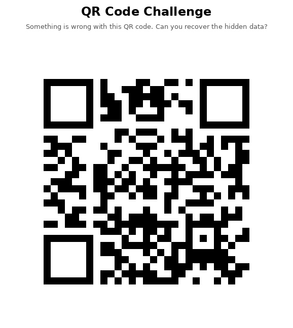
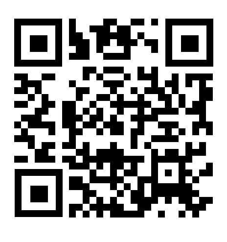

# Broken Signal

Il a été fournit un image de QR code endommagé.


Ce que j'ai fait en premier a été de restorer le QR code avec `Gimp`.
J'ai obtenu cette magnifique QR code


Je l'ai scanné avec un scanner en ligne, et j'ai obtenu ce magnifique flag
`CCOI26{https://www.linkedin.com/company/ocoi}`

Et on a fini le challenge 

JE RIGOLE ...😝

On est tombé sur un fake flag mais au moins , on connait tous le profil linkedin de l'OCOI 😉

Bon! Continuons, l'investigation

```bash

$ file Broken_signal\ qrcode\(1\).png 
Broken_signal qrcode(1).png: PNG image data, 578 x 648, 8-bit/color RGB, non-interlaced

$ exiftool Broken_signal\ qrcode\(1\).png 
ExifTool Version Number         : 12.57
File Name                       : Broken_signal qrcode(1).png
Directory                       : .
File Size                       : 11 kB
File Modification Date/Time     : 2026:02:22 12:25:54+03:00
File Access Date/Time           : 2026:02:23 20:08:28+03:00
File Inode Change Date/Time     : 2026:02:22 12:25:55+03:00
File Permissions                : -rw-r--r--
File Type                       : PNG
File Type Extension             : png
MIME Type                       : image/png
Image Width                     : 578
Image Height                    : 648
Bit Depth                       : 8
Color Type                      : RGB
Compression                     : Deflate/Inflate
Filter                          : Adaptive
Interlace                       : Noninterlaced
Image Size                      : 578x648
Megapixels                      : 0.375

$ strings Broken_signal\ qrcode\(1\).png 
IHDR
IDATx
&*[O
QJJJv
zk5W
q;\m
-U=D
L&O9
Yg-\
=*=X;
7N/?o
_JoE
g~:y
uj~~
_***J
t+&M
/++;
W_M-
Jaaa~~~
w9EEEO=
5j4y
SAAAqq
d23c
@`^T
D"QPP
,X0u
/,,,
)**Z
PIII^^
p6cHmQIII
WXXX
?,**
0`@z%
;wn^^^
3fLqqqU[t
M3W[
5==vx@
+))i
j,//
|[e#
;vL$
:u*))
_~9x
.VRR
H$JKK[
Aiii5
~5+O
+U\\
T\\\VV
sJzOVs
9O2wH
*--}
d2Yn
:(uI
ZqOVs
*n]^^
jqz|
Eeee
pa~~
QU[t
 0/*
{yyy
4k>;
=;YngO
u1#{]
@]<zn
r;o}n
r;#{
u1k~
oJD9
IEND

$ zsteg Broken_signal\ qrcode\(1\).png          
imagedata           .. text: "\r\r\r%%%XXX"
b1,r,lsb,xy         .. text: "CCOI26{0c01_15_w4tch1ng_y0u}"
b1,r,msb,xy         .. file: BS image, Version 37618, Quantization 49858, (Decompresses to 0 words)
b2,r,msb,xy         .. file: VISX image file
b4,r,msb,xy         .. text: ["w" repeated 13 times]
b4,bgr,msb,xy       .. file: MPEG ADTS, layer I, v2, 112 kbps, Monaural

```

Hummm ... tiens tiens tiens! Est_ce enfin notre flag 🧐

Mais ouiiiii 🥳

*Flag :* `CCOI26{0c01_15_w4tch1ng_y0u}`
