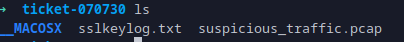
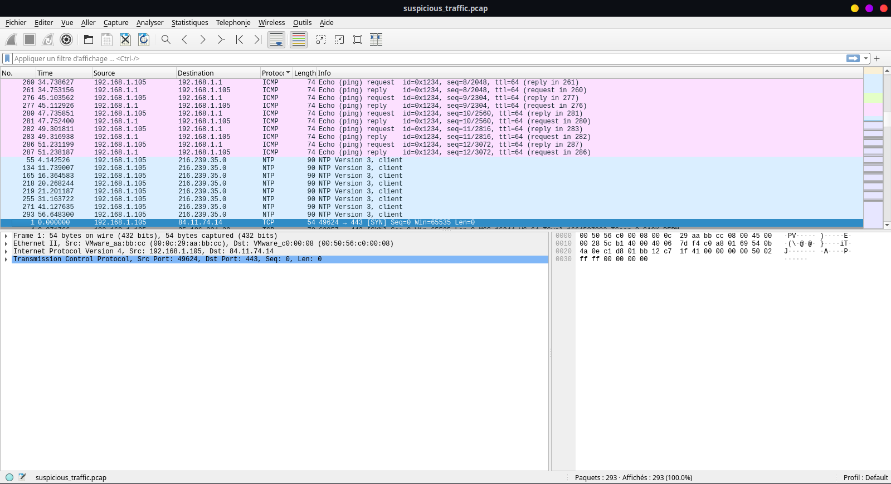
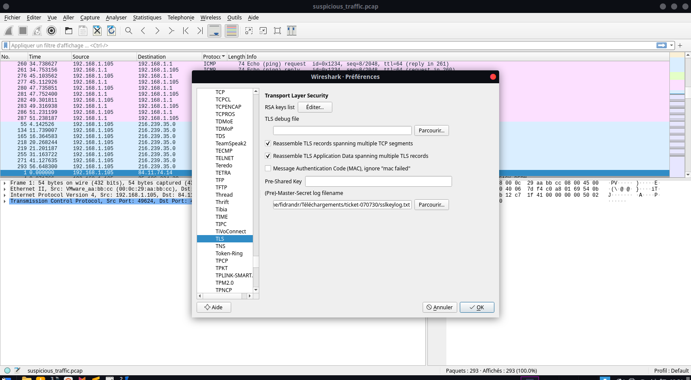

# CMRS-974 - Ticket 07071730

## Detail du challenge

On nous a founi le fichier ***ticket-070730.zip***
Dedans, on a 2 fichiers



## Wireshark

Ouverture du fichier pcap dans wireshark


Chargement du fichier **_sslkeylog.txt_** 


Apres voir charger les cle ssl et exporter object HTTP

On obtient plein de fichier dont les contenus ci dessus:

```text
➜  httpObjects ls
 currently-playing  'playlists(3)'          'playlists(6)'   token
 playlists          'playlists%3flimit=50'  'playlists(7)'  'token(1)'
'playlists(1)'      'playlists(4)'          'playlists(8)'  'tracks%3flimit=20'
'playlists(2)'      'playlists(5)'          'playlists(9)'
➜  httpObjects cat *
{"is_playing": true, "item": {"name": "Libertalia", "artists": [{"name": "Pirate Symphony"}], "album": {"name": "Indian Ocean Tales"}, "duration_ms": 245000, "progress_ms": 120000}}{"name": "Mon tresor a qui saura le prendre", "description": "7b2241223a226131222c2242223a226132222c2243223a226133222c2244223a226231222c2245223a226232222c2246223a226233222c2247223a226331222c2248223a226332222c2249223a226333222c224a223a226134222c224b223a226135222c224c223a226136222c224d223a226234222c224e223a226235222c224f223a226236222c2250223a226334222c2251223a226335222c2252223a226336222c2253223a226431222c2254223a226432222c2255223a226433222c2256223a226434222c2257223a226435222c2258223a226436222c2259223a226437222c225a223a226438222c2261223a226531222c2262223a226532222c2263223a226533222c2264223a226631222c2265223a226632222c2266223a226633222c2267223a226731222c2268223a226732222c2269223a226733222c226a223a226534222c226b223a226535222c226c223a226536222c226d223a226634222c226e223a226635222c226f223a226636222c2270223a226734222c2271223a226735222c2272223a226736222c2273223a226831222c2274223a226832222c2275223a226833222c2276223a226834222c2277223a226835222c2278223a226836222c2279223a226837222c227a223a226838222c2230223a226930222c2231223a226931222c2232223a226932222c2233223a226933222c2234223a226934222c2235223a226935222c2236223a226936222c2237223a226937222c2238223a226938222c2239223a226939222c222b223a226a31222c222f223a226a32222c223d223a226a33227d", "public": false}{"id": "7bR4kXn8LaBuSe0001", "name": "Mon tresor a qui saura le prendre", "description": "7b2241223a226131222c2242223a226132222c2243223a226133222c2244223a226231222c2245223a226232222c2246223a226233222c2247223a226331222c2248223a226332222c2249223a226333222c224a223a226134222c224b223a226135222c224c223a226136222c224d223a226234222c224e223a226235222c224f223a226236222c2250223a226334222c2251223a226335222c2252223a226336222c2253223a226431222c2254223a226432222c2255223a226433222c2256223a226434222c2257223a226435222c2258223a226436222c2259223a226437222c225a223a226438222c2261223a226531222c2262223a226532222c2263223a226533222c2264223a226631222c2265223a226632222c2266223a226633222c2267223a226731222c2268223a226732222c2269223a226733222c226a223a226534222c226b223a226535222c226c223a226536222c226d223a226634222c226e223a226635222c226f223a226636222c2270223a226734222c2271223a226735222c2272223a226736222c2273223a226831222c2274223a226832222c2275223a226833222c2276223a226834222c2277223a226835222c2278223a226836222c2279223a226837222c227a223a226838222c2230223a226930222c2231223a226931222c2232223a226932222c2233223a226933222c2234223a226934222c2235223a226935222c2236223a226936222c2237223a226937222c2238223a226938222c2239223a226939222c222b223a226a31222c222f223a226a32222c223d223a226a33227d", "public": false, "owner": {"id": "levasseur_974", "display_name": "Olivier L."}, "tracks": {"total": 0}}{"name": "inpayloadwetrust0", "description": "c3h7a2a3d7d5b5g6f1d6a1g1d7i3a4e6d8c1d4h3f1c1e6g2e2c2b4g1a6d1a2b2d2h7a2b6d2i1c5g1d3i0g2a2d3e5d3a5c3h7a2c2d8d5i5e6e3f4b3i0d8d5c5i6c3b1c3h5b4e4d3h2b4b1b2h2b4d2d3a5a3e6h2e5d7d6c6g2d7f4b3h8d8d4i0a5e1c1i9h8f1a3a1i9c3b1b2h5a6e4b2h5a6e4d3h5a6e4b2h7a3f5a2h4e3f5c5g1c4d1a1i1b5b1b4h7a3f5d4h8d8d6a4h3d7d5i1e6c3b1", "public": false}{"id": "7bR4kXn8LaBuSe0002", "name": "inpayloadwetrust0", "description": "c3h7a2a3d7d5b5g6f1d6a1g1d7i3a4e6d8c1d4h3f1c1e6g2e2c2b4g1a6d1a2b2d2h7a2b6d2i1c5g1d3i0g2a2d3e5d3a5c3h7a2c2d8d5i5e6e3f4b3i0d8d5c5i6c3b1c3h5b4e4d3h2b4b1b2h2b4d2d3a5a3e6h2e5d7d6c6g2d7f4b3h8d8d4i0a5e1c1i9h8f1a3a1i9c3b1b2h5a6e4b2h5a6e4d3h5a6e4b2h7a3f5a2h4e3f5c5g1c4d1a1i1b5b1b4h7a3f5d4h8d8d6a4h3d7d5i1e6c3b1", "public": false, "owner": {"id": "levasseur_974", "display_name": "Olivier L."}, "tracks": {"total": 0}}{"items": [{"id": "existing1", "name": "Discover Weekly", "tracks": {"total": 30}}, {"id": "existing2", "name": "Release Radar", "tracks": {"total": 25}}], "total": 2}{"name": "inpayloadwetrust300", "description": "i0g1e3i3d8e4d6i2a4g2d7i2h2i1e3a1g4h5d7d6b5h8f1i2i9h7d8a3a1i9c3b2h1i4e3h7b5c5e3f4i9e5c3d2c3h5b4e4d4i4d5g1f6a5d5i3b5h8e1b3i9g6d8d6e6h8d6c5g4g2d8c1i1g4e2e6i9f6d7d6b5f6c3b1i0g1a4b1d7e5e3f4i9i1e2f4c6h8c4d2d3h5b4b1a1e5e3i2b3h1f1c2b5g2e2c2c5e5e1c1b3h8e1c1d4e5d6i3d8g2e2c2d4e6d6i2g2e6e3f4d4f3e3c1h6g2d7i2d4f6", "public": false}{"id": "7bR4kXn8LaBuSe0003", "name": "inpayloadwetrust300", "description": "i0g1e3i3d8e4d6i2a4g2d7i2h2i1e3a1g4h5d7d6b5h8f1i2i9h7d8a3a1i9c3b2h1i4e3h7b5c5e3f4i9e5c3d2c3h5b4e4d4i4d5g1f6a5d5i3b5h8e1b3i9g6d8d6e6h8d6c5g4g2d8c1i1g4e2e6i9f6d7d6b5f6c3b1i0g1a4b1d7e5e3f4i9i1e2f4c6h8c4d2d3h5b4b1a1e5e3i2b3h1f1c2b5g2e2c2c5e5e1c1b3h8e1c1d4e5d6i3d8g2e2c2d4e6d6i2g2e6e3f4d4f3e3c1h6g2d7i2d4f6", "public": false, "owner": {"id": "levasseur_974", "display_name": "Olivier L."}, "tracks": {"total": 0}}{"name": "inpayloadwetrust600", "description": "e2i2h6e5d8d6c3a5a3e6h2g2e3c1e6f1a3f4e6h3f1c1d4h7e2f4b3h1d6i3c6h4e1i2d4h3c3b1i0g1c5i0b5c4d1d6h2h2b4c1i5f3f1c2c3h8e3h8a2h7d6i2b3f3e3d6d3h6d6i3b4i0f1d6c3i0d6i2h5h8d6i3a2h7b4i2i5e5e3e4b5f3c3d1b3i9a3f4g4i3f1b3i9h8d8d5b5h7d8d6c5g1c4d1a2h2f2d4b5i1e3b1b5h7d3h8b5e4e3f4d4i0d1e6f1d3c3d3h2e6f2d2c3h5b4e4d3a5a3e6", "public": false}{"id": "7bR4kXn8LaBuSe0004", "name": "inpayloadwetrust600", "description": "e2i2h6e5d8d6c3a5a3e6h2g2e3c1e6f1a3f4e6h3f1c1d4h7e2f4b3h1d6i3c6h4e1i2d4h3c3b1i0g1c5i0b5c4d1d6h2h2b4c1i5f3f1c2c3h8e3h8a2h7d6i2b3f3e3d6d3h6d6i3b4i0f1d6c3i0d6i2h5h8d6i3a2h7b4i2i5e5e3e4b5f3c3d1b3i9a3f4g4i3f1b3i9h8d8d5b5h7d8d6c5g1c4d1a2h2f2d4b5i1e3b1b5h7d3h8b5e4e3f4d4i0d1e6f1d3c3d3h2e6f2d2c3h5b4e4d3a5a3e6", "public": false, "owner": {"id": "levasseur_974", "display_name": "Olivier L."}, "tracks": {"total": 0}}{"name": "inpayloadwetrust900", "description": "h2h8e2d6c6h5d6c5g4h7d8d5h6g2f2d1a1i9c3c2b5h2f1c2a1h3e1d5i5i0d8d6a4h3d7d5h5h3d7i2i9h7e3a1g4i1e3i2d4h7e2f4b3h2d8d1a1i9c3c1b3h1d8d6a4i0e3i0a2e4e2i3a4h5a6f4h6h4d7i2b3h1a3f5a2g2e3i3b5i3e2i3a4e5c3b1i0g1d3i2i0i3e3a3b3d1b4i2h6g2f2d1b4h7b4b1c3i1a3g1j3j3", "public": false}{"id": "7bR4kXn8LaBuSe0005", "name": "inpayloadwetrust900", "description": "h2h8e2d6c6h5d6c5g4h7d8d5h6g2f2d1a1i9c3c2b5h2f1c2a1h3e1d5i5i0d8d6a4h3d7d5h5h3d7i2i9h7e3a1g4i1e3i2d4h7e2f4b3h2d8d1a1i9c3c1b3h1d8d6a4i0e3i0a2e4e2i3a4h5a6f4h6h4d7i2b3h1a3f5a2g2e3i3b5i3e2i3a4e5c3b1i0g1d3i2i0i3e3a3b3d1b4i2h6g2f2d1b4h7b4b1c3i1a3g1j3j3", "public": false, "owner": {"id": "levasseur_974", "display_name": "Olivier L."}, "tracks": {"total": 0}}grant_type=authorization_code&code=AQD_labuse_1730&redirect_uri=http://localhost:8888/callback{"access_token": "BQDxkXn8_levasseur_974_bearer_token", "token_type": "Bearer", "expires_in": 3600, "refresh_token": "AQA_saintdenis_bourbon_refresh", "scope": "playlist-modify-private playlist-read-private"}{"items": [{"track": {"name": "Skull and Bones", "artists": [{"name": "Pirates"}], "duration_ms": 180000}}, {"track": {"name": "La Buse Theme", "artists": [{"name": "Reunion Be➜  httpObjects 
```

Maintenant, il reste le decodage! :) c'est un codage de substitution hexadecimal!

```python
#!/usr/bin/env python3
import json

substitution_hex = "7b2241223a226131222c2242223a226132222c2243223a226133222c2244223a226231222c2245223a226232222c2246223a226233222c2247223a226331222c2248223a226332222c2249223a226333222c224a223a226134222c224b223a226135222c224c223a226136222c224d223a226234222c224e223a226235222c224f223a226236222c2250223a226334222c2251223a226335222c2252223a226336222c2253223a226431222c2254223a226432222c2255223a226433222c2256223a226434222c2257223a226435222c2258223a226436222c2259223a226437222c225a223a226438222c2261223a226531222c2262223a226532222c2263223a226533222c2264223a226631222c2265223a226632222c2266223a226633222c2267223a226731222c2268223a226732222c2269223a226733222c226a223a226534222c226b223a226535222c226c223a226536222c226d223a226634222c226e223a226635222c226f223a226636222c2270223a226734222c2271223a226735222c2272223a226736222c2273223a226831222c2274223a226832222c2275223a226833222c2276223a226834222c2277223a226835222c2278223a226836222c2279223a226837222c227a223a226838222c2230223a226930222c2231223a226931222c2232223a226932222c2233223a226933222c2234223a226934222c2235223a226935222c2236223a226936222c2237223a226937222c2238223a226938222c2239223a226939222c222b223a226a31222c222f223a226a32222c223d223a226a33227d"
#chargement de la table en json format
substitution_json = bytes.fromhex(substitution_hex).decode('utf-8')
substitution_table = json.loads(substitution_json)

json.dumps(substitution_table, indent=2)

# Les payloads encodés
payloads = {
    0: "c3h7a2a3d7d5b5g6f1d6a1g1d7i3a4e6d8c1d4h3f1c1e6g2e2c2b4g1a6d1a2b2d2h7a2b6d2i1c5g1d3i0g2a2d3e5d3a5c3h7a2c2d8d5i5e6e3f4b3i0d8d5c5i6c3b1c3h5b4e4d3h2b4b1b2h2b4d2d3a5a3e6h2e5d7d6c6g2d7f4b3h8d8d4i0a5e1c1i9h8f1a3a1i9c3b1b2h5a6e4b2h5a6e4d3h5a6e4b2h7a3f5a2h4e3f5c5g1c4d1a1i1b5b1b4h7a3f5d4h8d8d6a4h3d7d5i1e6c3b1",
    300: "i0g1e3i3d8e4d6i2a4g2d7i2h2i1e3a1g4h5d7d6b5h8f1i2i9h7d8a3a1i9c3b2h1i4e3h7b5c5e3f4i9e5c3d2c3h5b4e4d4i4d5g1f6a5d5i3b5h8e1b3i9g6d8d6e6h8d6c5g4g2d8c1i1g4e2e6i9f6d7d6b5f6c3b1i0g1a4b1d7e5e3f4i9i1e2f4c6h8c4d2d3h5b4b1a1e5e3i2b3h1f1c2b5g2e2c2c5e5e1c1b3h8e1c1d4e5d6i3d8g2e2c2d4e6d6i2g2e6e3f4d4f3e3c1h6g2d7i2d4f6",
    600: "e2i2h6e5d8d6c3a5a3e6h2g2e3c1e6f1a3f4e6h3f1c1d4h7e2f4b3h1d6i3c6h4e1i2d4h3c3b1i0g1c5i0b5c4d1d6h2h2b4c1i5f3f1c2c3h8e3h8a2h7d6i2b3f3e3d6d3h6d6i3b4i0f1d6c3i0d6i2h5h8d6i3a2h7b4i2i5e5e3e4b5f3c3d1b3i9a3f4g4i3f1b3i9h8d8d5b5h7d8d6c5g1c4d1a2h2f2d4b5i1e3b1b5h7d3h8b5e4e3f4d4i0d1e6f1d3c3d3h2e6f2d2c3h5b4e4d3a5a3e6",
    900: "h2h8e2d6c6h5d6c5g4h7d8d5h6g2f2d1a1i9c3c2b5h2f1c2a1h3e1d5i5i0d8d6a4h3d7d5h5h3d7i2i9h7e3a1g4i1e3i2d4h7e2f4b3h2d8d1a1i9c3c1b3h1d8d6a4i0e3i0a2e4e2i3a4h5a6f4h6h4d7i2b3h1a3f5a2g2e3i3b5i3e2i3a4e5c3b1i0g1d3i2i0i3e3a3b3d1b4i2h6g2f2d1b4h7b4b1c3i1a3g1j3j3"
}

def decode_payload(encoded, sub_table):
    decoded = []
    i = 0
    while i < len(encoded):
        if i + 1 < len(encoded):
            token = encoded[i:i+2]
            for key, value in sub_table.items():
                if value == token:
                    decoded.append(key)
                    break
            i += 2
        else:
            i += 1
    
    return ''.join(decoded)

all_decoded = []
for offset, payload in sorted(payloads.items()):
    decoded = decode_payload(payload, substitution_table)
    all_decoded.append(decoded)

full_message = ''.join(all_decoded)
print(full_message)

```

Là, On obtient un text encodé en base64 qu'on peut decoder facilement avec :

```bash

echo -n "IyBCYWNrdXAgY3JlZGVudGlhbHMgLSBETyBOT1QgU0hBUkUKIyBHZW5lcmF0ZWQ6IDIwMjUtMDEtMTUKCltkYXRhYmFzZV0KaG9zdCA9IDEwLjEwLjUwLjEyCnBvcnQgPSA1NDMyCnVzZXJuYW1lID0gc3ZjX2JhY2t1cApwYXNzd29yZCA9IEs4cyNQcm9kITIwMjV4WgoKW3NzaF9rZXlzXQphZG1pbl9oYXNoID0gJDYkcm91bmRzPTUwMDAkc2FsdHNhbHQkaGFzaGVkX3ZhbHVlX2hlcmVfcGxhY2Vob2xkZXIKClthcGldCmludGVybmFsX3Rva2VuID0gQ0NPSXttMG5fdHIzczByX2FfcXUxX3M0dXI0X2wzX3ByM25kcjNfISF9Cmp3dF9zZWNyZXQgPSBteVN1cDNyUzNjcmV0SldUIUtleTIwMjUKCltzbXRwXQpyZWxheSA9IHNtdHAuaW50ZXJuYWwuY29ycAp1c2VybmFtZSA9IGFsZXJ0c0Bjb3JwLmxvY2FsCnBhc3N3b3JkID0gU203cCFSM2xheSMyMDI1Cg==" | base64 -d

```

Le resultat:
```text
# Backup credentials - DO NOT SHARE
# Generated: 2025-01-15

[database]
host = 10.10.50.12
port = 5432
username = svc_backup
password = K8s#Prod!2025xZ

[ssh_keys]
admin_hash = $6$rounds=5000$saltsalt$hashed_value_here_placeholder

[api]
internal_token = CCOI{m0n_tr3s0r_a_qu1_s4ur4_l3_pr3ndr3_!!}
jwt_secret = mySup3rS3cretJWT!Key2025

[smtp]
relay = smtp.internal.corp
username = alerts@corp.local
password = Sm7p!R3lay#2025


```
