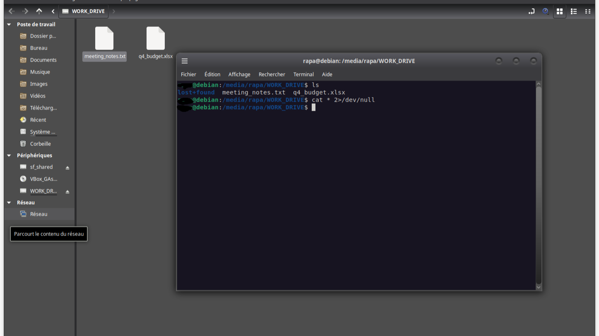

# Follow Format

fichier joint: `challenge.img`

Comme à chaque fois que je reçois un fichier, mon premier reflexe a été l'investigation classique: `file`, `strings`, `exiftool`, `zsteg`, `binwalk`, etc...

## *__file__*
```bash
$ file challenge.img
challenge.img: Linux rev 1.0 ext4 filesystem data, UUID=ae6148e4-8e10-49db-a77b-9c52b2529b02, volume name "WORK_DRIVE" (extents) (64bit) (large files) (huge files)
```
Ici, on voit que c'est un volume. Alors, j'ai essayé de le mount pour voir!



Cela ne donne rien. Alors, on continue l'investigation!

## *__strings__*
```bash
$ strings challenge.img
WORK_DRIVE
/mnt_point
lost+found
q4_budget.xlsx
meeting_notes.txt
vq,i
WORK_DRIVE
CCOI26{iNod3_n3v3r_f0rg3ts_2026}
WORK_DRIVE
WORK_DRIVE
lost+found
q4_budget.xlsx
meeting_notes.txt
WORK_DRIVE
/mnt_point
OiFC
lost+found
q4_budget.xlsx
meeting_notes.txt
WORK_DRIVE
WORK_DRIVE
Hn]a
$
```

C'est ainsi qu'on recupere le flag
```text
CCOI26{iNod3_n3v3r_f0rg3ts_2026}
```
Fin de l'investigation! 🥳
