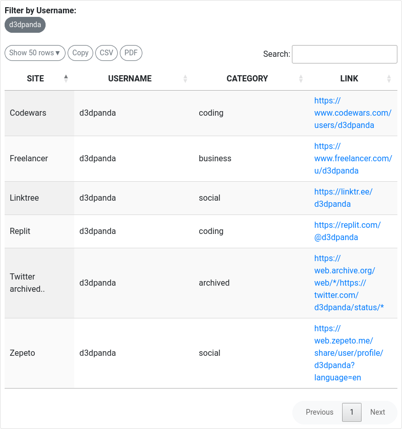
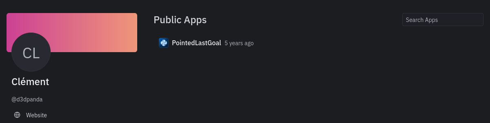
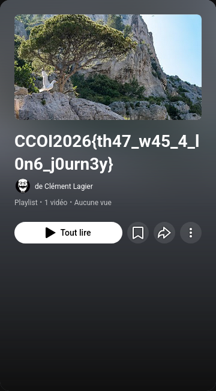

# Write-up : Challenge OSINT - "Who is this guy?"

## 🕵️‍♂️ Étapes de l'investigation

### 1. Recherche de pseudonyme (Username Hunting)
La première étape consiste à identifier sur quelles plateformes ce pseudonyme est actif. Pour cela, nous utilisons l'outil **WhatsMyName**.

* **Outil :** [WhatsMyName Web](https://whatsmyname.app)
* **Action :** Recherche du terme `d3dpanda`.
  

### 2. Analyse des résultats : Le pivot Replit
Parmi les différents résultats, un profil sort du lot : **Replit**, une plateforme de développement en ligne.

* **Lien du profil :** [https://replit.com/@d3dpanda](https://replit.com/@d3dpanda)
* **Observation :** Sur le profil Replit, l'utilisateur a renseigné un lien vers son "site web".
  

### 3. Redirection et découverte finale
En cliquant sur le lien "website" présent sur Replit, nous sommes redirigés vers une plateforme tierce.

* **Destination :** Une playlist YouTube.
* **Lien :** [https://www.youtube.com/playlist?list=PLft21X0bRMdPjc_bLSFEb1vzfJdPZ8Qld](https://www.youtube.com/playlist?list=PLft21X0bRMdPjc_bLSFEb1vzfJdPZ8Qld)
* **Résultat :** le flag est révélé dans le titre du playlist.

---

## 🚩 Flag

